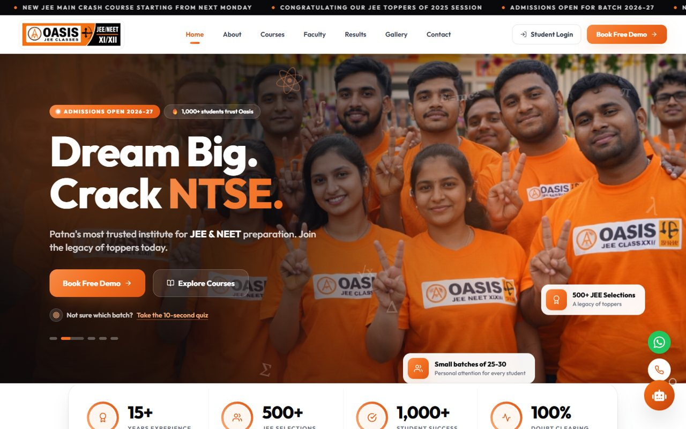
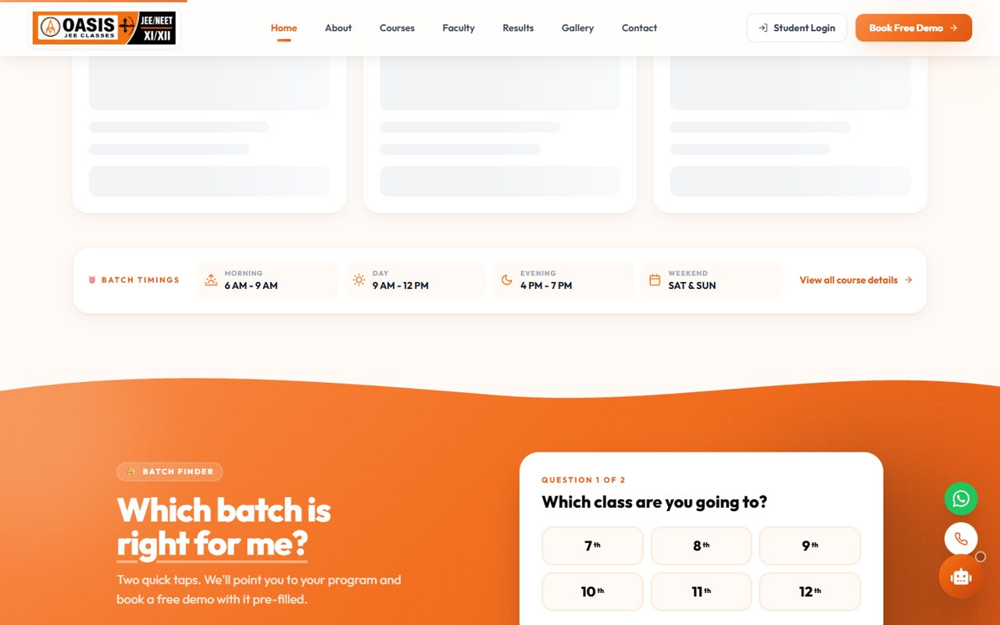
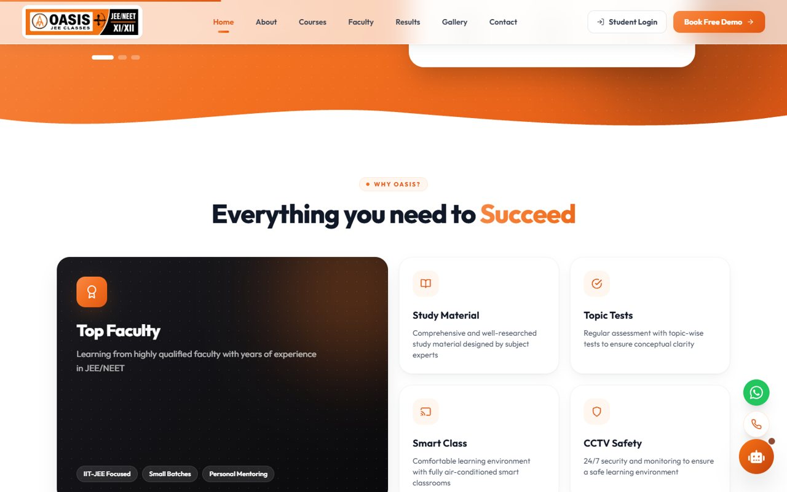
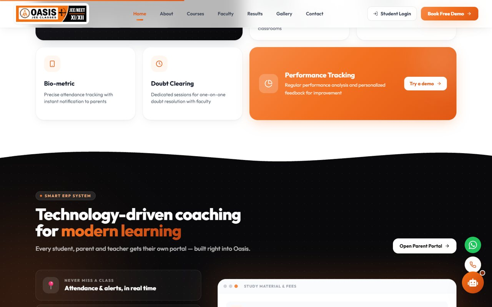
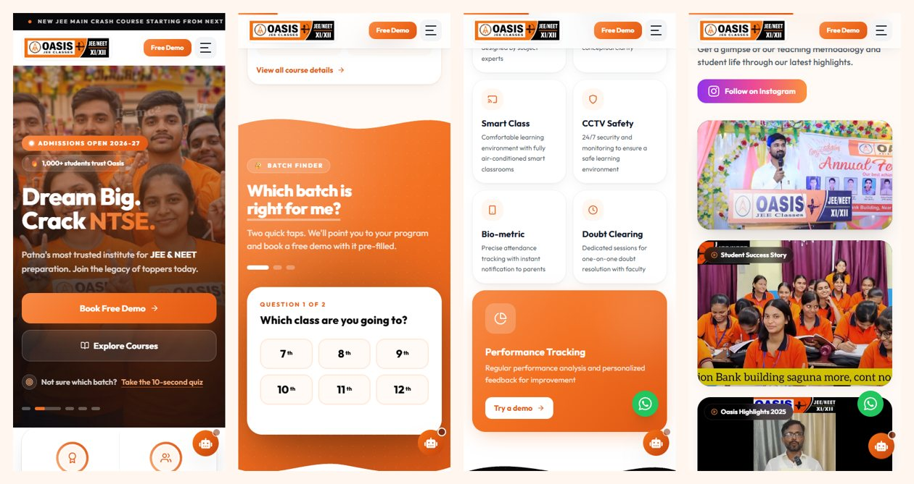
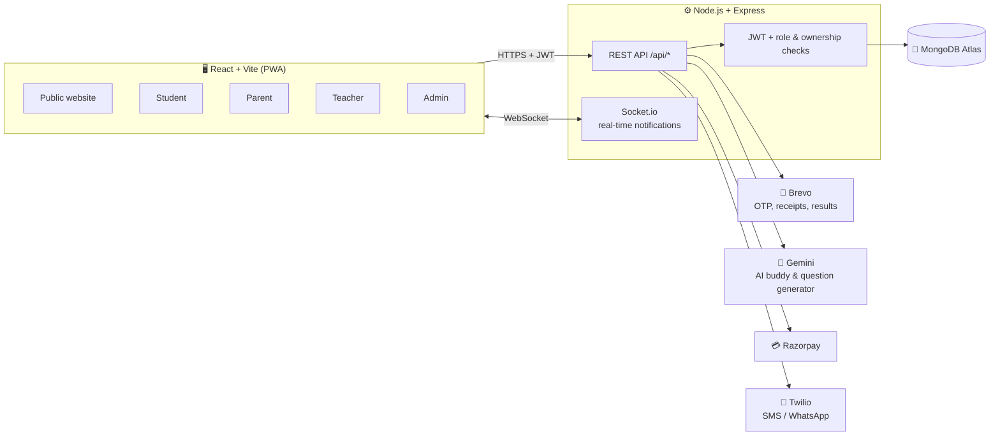

<div align="center">


# Oasis JEE Classes — Smart Coaching Platform

**A complete website + ERP for a JEE / NEET coaching institute in Patna.**
Marketing site, online tests, live classes, QR attendance, fees, results and AI — with dedicated portals for **students, parents, teachers and admins**.

[](https://react.dev)
[](https://vite.dev)
[](https://tailwindcss.com)
[](https://expressjs.com)
[](https://mongoosejs.com)
[](https://socket.io)
[](https://ai.google.dev)
[](#)

[🌐 Website](https://oasisjeeclasses.com) &nbsp;·&nbsp; [✨ Features](#-features) &nbsp;·&nbsp; [🚀 Quick start](#-quick-start) &nbsp;·&nbsp; [🔐 Environment](#-environment-variables) &nbsp;·&nbsp; [🗂️ Structure](#️-project-structure)

</div>

---

## 📸 Preview

<p align="center">
  
</p>

<table>
  <tr>
    <td width="50%"><p align="center"><b>Batch finder quiz</b> — 2 taps to the right program</p></td>
    <td width="50%"><p align="center"><b>Why Oasis</b> — bento-grid highlights</p></td>
  </tr>
  <tr>
    <td width="50%"><p align="center"><b>Smart ERP</b> — portals for every role</p></td>
    <td width="50%"><p align="center"><b>Mobile-first</b> — looks great on any phone</p></td>
  </tr>
</table>

---

## ✨ Features

### 🏠 Public website
- Animated hero with rotating headline, floating stats and a **"Which batch is right for me?"** quiz
- Courses with class picker (7th–12th), faculty flip-cards, toppers wall, events gallery, FAQ
- **Free-demo booking** form → admin gets a real-time lead + the visitor gets a confirmation email
- **AI Study Buddy** chat (Gemini) for doubts and site navigation, WhatsApp & call shortcuts
- Installable **PWA**, fully responsive, light theme, `prefers-reduced-motion` aware

<table>
<tr>
<td width="50%" valign="top">

### 🎓 Student portal
- Dashboard with **streak 🔥**, progress rings & achievement badges
- **Timetable** with live "Now / Next" class
- **JEE-style online tests** — MCQ + numerical, negative marking, timer, question palette
- Results with **leaderboard / podium** & subject-wise analysis
- **Live classes** (join = auto attendance) & **video library** with progress
- **QR + GPS attendance** scan, doubts with image upload, AI buddy
- Fees, receipts, report card, notices, digital ID card

</td>
<td width="50%" valign="top">

### 👨‍👩‍👦 Parent portal
- Multi-child switcher
- **Child health check** — attendance, test average, fees paid
- 30-day attendance heat-strip & performance trends
- Test results with class rank
- **Pay fees online** (Razorpay) or submit UPI / bank transfer for approval
- Downloadable **monthly progress report**
- Real-time notifications (absent alert, results, fee reminders)

</td>
</tr>
<tr>
<td width="50%" valign="top">

### 👨‍🏫 Teacher portal
- "Today" timeline, daily **check-in**, quick actions
- **Attendance** — bulk roster or rotating **QR code**
- **Marks** — single, bulk sheet, or paste from Excel
- **Test builder** with ✨ **AI question generator** (Gemini)
- Schedule & manage live classes, videos, study material
- Doubt board with chat-style replies

</td>
<td width="50%" valign="top">

### ⚙️ Admin portal
- Live analytics: enrolment, revenue, today's attendance
- **Needs-attention** panel & `Ctrl/⌘ + K` command palette
- Students, teachers & parents — add, link, remove
- **Academics** — classes, batches, subjects & **timetable builder**
- **Fees** — approvals, defaulters, reminders, receipts
- **Results center** — publish exams & report cards (with email)
- Notice center with email broadcast · **Leads CRM** (list + kanban)

</td>
</tr>
</table>

### 🔒 Built-in security
JWT auth with role-based access · per-student ownership checks · test answers never sent to students · OTP-verified signup with attempt limits · rate limiting on login, OTP & AI · safe uploads (images/PDF, 10 MB, random names) · authenticated real-time sockets.

---

## 🧱 Tech stack

| Layer | Technology |
|---|---|
| **Frontend** | React 19, Vite 7, Tailwind CSS 3, React Router 7, Chart.js, Socket.io client, react-hot-toast, html5-qrcode, vite-plugin-pwa |
| **Backend** | Node.js, Express 4, Mongoose 7 (MongoDB Atlas), Socket.io 4, JWT, bcrypt, Multer |
| **Integrations** | Brevo (email), Google Gemini (AI), Razorpay (payments), Twilio (SMS / WhatsApp) |
| **Hosting** | Frontend on Vercel · API on Render · Database on MongoDB Atlas |

## 🏗️ Architecture



---

## 🚀 Quick start

### Prerequisites
- **Node.js 18+** (developed on Node 24)
- A **MongoDB** connection string (MongoDB Atlas free tier works)
- Optional: Brevo, Gemini, Razorpay and Twilio keys (see [Environment](#-environment-variables))

### 1. Clone
```bash
git clone https://github.com/Rishav5505/Oasispatna.git
cd Oasispatna
```

### 2. Backend
```bash
cd backend
npm install
cp .env.example .env      # then fill in your values
npm run dev               # http://localhost:5002
```

### 3. Frontend
```bash
cd my-app
npm install
cp .env.example .env      # optional (Razorpay public key)
npm run dev               # http://localhost:5173
```

> **💡 Tip:** without email configured you can still test signup / password reset locally — set `OTP_CONSOLE_FALLBACK=true` in `backend/.env` and the OTP is printed in the backend terminal. **Never** set this in production.

### Create the first admin (optional)
```bash
cd backend
node seed.js              # creates admin@oasis.com — see seed.js for the default password
```
Log in as **Admin**, change the password right away, then create classes, batches, subjects and teachers from the **Academics** and **People** tabs.

---

## 🔐 Environment variables

Full template: [`backend/.env.example`](backend/.env.example)

| Variable | Required | Purpose |
|---|:---:|---|
| `MONGO_URI` | ✅ | MongoDB connection string |
| `JWT_SECRET` | ✅ | Secret used to sign login tokens |
| `PORT` | | API port (default `5002`) |
| `FRONTEND_URL` | | Website URL used in emails (login links) |
| `BREVO_API_KEY` · `SENDER_EMAIL` | 📧 | OTP, receipts, results & notice emails (sender must be verified in Brevo) |
| `GEMINI_API_KEY` | 🤖 | AI Study Buddy & AI question generator |
| `GEMINI_MODELS` | | Optional fallback order of Gemini models |
| `RAZORPAY_KEY_ID` · `RAZORPAY_KEY_SECRET` | 💳 | Online fee payment (disabled until set) |
| `TWILIO_SID` · `TWILIO_AUTH_TOKEN` · `TWILIO_PHONE` · `TWILIO_WHATSAPP` | 📱 | SMS / WhatsApp alerts to parents (skipped until set) |
| `INSTITUTE_LAT` · `INSTITUTE_LON` · `MAX_ATTENDANCE_DISTANCE` | 📍 | Geofence for QR attendance (metres) |
| `TRUST_PROXY` | | Proxy hops for correct client IPs (auto on Render) |
| `OTP_CONSOLE_FALLBACK` | 🧪 | **Local dev only** — print OTPs in the console |

Frontend (`my-app/.env`): `VITE_RAZORPAY_KEY_ID` — Razorpay public key.

---

## 🗂️ Project structure

```
Oasispatna/
├── backend/                 # Express + MongoDB API
│   ├── server.js            # App, Socket.io, route mounting
│   ├── routes/              # auth, users, attendance, marks, fees, tests,
│   │                        # live-classes, videos, doubts, academics, schedule,
│   │                        # notices, leads, analytics, ai-buddy …
│   ├── models/              # Mongoose schemas (User, Student, OnlineTest, Fee …)
│   ├── middleware/          # JWT auth & role guard
│   └── utils/               # email, SMS, OTP, uploads, access control, rate limit
│
├── my-app/                  # React + Vite frontend (PWA)
│   └── src/
│       ├── pages/           # Login, Register, role dashboards
│       │   └── public/      # Home, About, Courses, Faculty, Results, Gallery, Contact
│       ├── components/
│       │   ├── home/        # Landing-page sections (hero, quiz, courses …)
│       │   ├── student/ parent/ teacher/ admin/   # Dashboard pieces per role
│       │   ├── test/ live/ video/ doubt/ attendance/ ai/
│       │   └── ui/          # Shared design system (StatCard, Reveal, AnimatedNumber …)
│       ├── contexts/        # Auth & theme
│       └── config.js        # API URL & payment config
│
└── docs/screenshots/        # Images used in this README
```

## 📜 Scripts

| Where | Command | What it does |
|---|---|---|
| `backend/` | `npm run dev` | Start API with auto-reload (nodemon) |
| `backend/` | `npm start` | Start API (production) |
| `my-app/` | `npm run dev` | Start frontend dev server |
| `my-app/` | `npm run build` | Production build to `dist/` |
| `my-app/` | `npm run preview` | Preview the production build |
| `my-app/` | `npm run lint` | Run ESLint |

---

## ☁️ Deployment

- **Frontend → Vercel:** root directory `my-app`, build `npm run build`, output `dist`. SPA routing is handled by `my-app/vercel.json`.
- **Backend → Render:** root directory `backend`, start `npm start`, add the environment variables above. In production the frontend talks to the API URL set in `my-app/src/config.js`.
- Deploy **frontend and backend together** — real-time notifications require matching versions.

---

<div align="center">

**Made with 🧡 in Patna for the future engineers & doctors of India**

<sub>Oasis JEE Classes · Union Bank Building, Danapur, Patna</sub>

</div>
